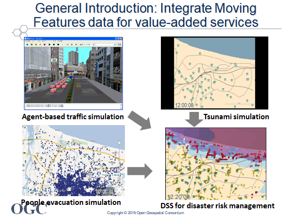
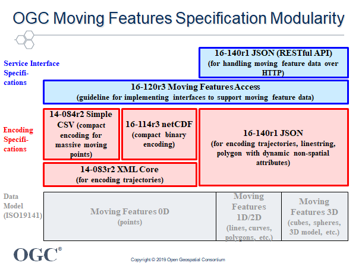
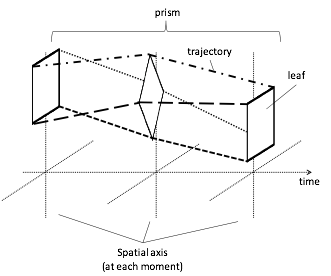
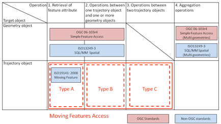

# OGC Moving Features

## What is focused on in this web site
OGC Moving Features is an OGC standard to handle geometries of many features that move, especially trajectories.
You can see the specification documents at http://www.opengeospatial.org/standards/movingfeatures
This site is intended for developers of OGC Moving Features applications.

---

## Overview of OGC Moving Features

### Scope

OGC Moving Features is applicable to GIS for managing features of which geometry changes by time.
Namely they have the following characteristics:

- Each moving feature can be described with Schema for Moving Features (ISO19141: 2008).
- The number of features simultaneously encoded with this format can be massive (many thousands of features).
- All features can be described using common space-time coordinates.

As shown the figure, systems relying on single-source moving feature data are now evolving into more integrated systems. Integration of moving feature data from different sources is a key to developing more innovative and advanced applications.

The figure illustrates the standard components for encoding and communicating Moving Features data. The boxes drawn in the figure portray the modules defined in the OGC Moving Features standard.

### OGC® Moving Features Encoding Part I: XML Core

OGC Moving Features Encoding Part I: XML Core is represented by an XML data encoding for moving points and their trajectories. The format is an extensible format to model and encode movement data for features encoded as point geometries.

The basic data model of OGC Moving Features is inheriting existing standard ISO19141:2008 Moving Features.
The above figure illustrates the concepts of foliation, prism, trajectory, and leaf, which are defined in ISO19141:2008[ISO 19141:2008]. In the illustration, a 2D rectangle moves and rotates. Each representation of the rectangle at a given time is a leaf. The path traced by each corner point of the rectangle is a trajectory. The set of points contained in all of the leaves, and in all of the trajectories, forms a prism. The set of leaves also forms a foliation.
The prism of the moving feature can be viewed as a bundle of trajectories of points on the local engineering representation of the feature’s geometry. If viewed in a 4 dimensional spatio-temporal coordinate system, the points on the feature at different times are different points.
Each moving feature has information to indicate the movement path, which is the trajectory shown in the prism model.

OGC Moving Features Encoding XML Core supports the structure.
The specification document is [here](http://docs.opengeospatial.org/is/18-075/18-075.html).

### OGC® Moving Features Encoding Extension: Simple Comma Separated Values (CSV)

OGC Moving Features Simple CSV Encoding is fundamental and is a data format to describe moving points and their trajectories. The format is designed to encode trajectories of moving points compactly as application schemas of IETF RFC 4180 (CSV).

The specification is [here](http://docs.opengeospatial.org/is/14-084r2/14-084r2.html).

### OGC Moving Features Access
This OGC Standard specifies abstract methods to access a database storing trajectory data of moving features.
The specification document is shown [here](http://docs.opengeospatial.org/is/16-120r3/16-120r3.html).

The figure summarizes the operations of existing access standards and Moving Features Access. Operations for geometry objects have been supported by OGC 06-103r4 (OpenGIS Implementation Standard for Geographic information - Simple feature access - Part 1: Common architecture) and ISO 13249-3 (Information technology — Database languages — SQL multimedia and application packages Part3: Spatial). Elements of trajectory operations are defined in ISO19141:2008.

This standard targets the following three types of operations.

#### Type A: Retrieval of feature attribute
 These operations retrieve positions, trajectories, and velocities of a moving feature such as a car, a person, a vessel, an aircraft, and a hurricane.

#### Type B: Operations between one trajectory object and one or more geometry objects
These operations perform an “intersection” between a geometry object like a administrative boundary and a trajectory of a moving feature like a car, a person, a vessel, an aircraft, and a hurricane.

#### Type C: Operations between two trajectory objects
An example of these operations is to calculate a distance of the nearest approach of a trajectory to another trajectory. Case studies include calculating the distance between a criminal agent and a police agent for predicting crime patterns or the distance between soccer players for making proper tactics.
This standard does not address all types of operations for trajectory data of moving features. Examples of operations that are out of scope include the following.
Aggregation operations

### OGC Moving Features Encoding Extension - JSON (now a standard candidate)
OGC Moving Features Encoding Extension - JSON, which is JSON-based encoding specification,
is now published as a [best practice paper](http://docs.opengeospatial.org/bp/16-140r1/16-140r1.html).

The OGC Moving Features JSON defines the structure and content of JSON (JavaScript Object Notation) [IETF RFC7159] encoding implementation of the conceptual model for moving features described in ISO 19141:2008.

It is now considered to be a OGC standard. See detail [here](https://ksookim.github.io/mf-json/).

### OGC Moving Features Binary Encoding

The netCDF Moving Features encoding extension is a summary of conventions that supports efficient exchange of simple moving features as binary files. The encoding style is published as a [Best Practice Paper](http://docs.opengeospatial.org/bp/16-114r3/16-114r3.html).

This Best Practice is a complement to the Moving Features Encoding Part I: XML Core and an alternative to the Simple Comma Separated Values (CSV) extension. Compared to the CSV encoding, this netCDF encoding offers more compact storage and better performance at the cost of additional restrictions on the kinds of features that can be stored.

### Applications
Use cases of OGC Moving Features are exampled in a discussion paper, [OGC Standard for Moving Features; Requirements](https://portal.opengeospatial.org/files/?artifact_id=51623) and
[Use Cases and Applications of the OGC Moving Features Standard: The Requirements for a Moving Feature API](https://portal.opengeospatial.org/files/?artifact_id=64623).

---
## Tutorial Documents
- [OGC Moving Features Encoding CSV loader in python](LoadOGCMovingFeaturesCSV.ipynb) (jupyter notebook)
